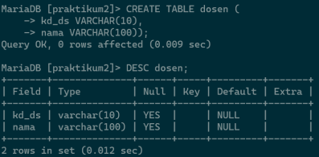
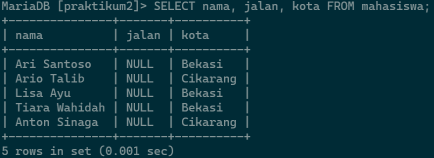

# Praktikum2_DDL

## **DDL (Data Definition Language) & DML (Data Manipulation Language)**
      
Transform **ER-D** ke dalam **Mapping Table**            
* **Data Model Mapping**        
    - **Mahasiswa** (**nim**, nama, jenis_kelamin, tgl_lahir, jalan, kota, kodepos, no_hp, kd_ds)     
    - **Dosen** (**kd_ds**, nama)     
    - **Matakuliah** (**kd_mk**, nama, sks)       
    - **JadwalMengajar** (**kd_ds**, **kd_mk**, hari, jam, ruang)     
    - **KRSMahasiswa** (**nim**, **kd_mk**, **kd_ds**, 
semester, nilai)       

### **A. Script DDL & DML**
1. **DDL *Script***     
    Data definition Language (DDL) adalah bahasa pemrogaraman yang digunakan untuk mengola objek database, seperti tabel, indeks, dan constraint. DDL digunakan untuk membuat, mengubah dan menghapus struktur database, termasuk tabel, kolom, kunci utama, indeks dan tampilan.       
    Berikut adalah perintah-perintah DDL yang digunakan untuk membuat sebuah DBMS berdasarkan skema diatas.
    - Membuat sebuah database: 
        ```sql
        CREATE DATABASE nama_database;
        ```
    - Menggunakan database:
        ```sql
        USE nama_database;
        ```
    - Membuat sebuah tabel:
        ```sql
        CREATE TABLE nama_tabel (field1,...,fieldn) VALUE
        (value1 tipe_data(ukuran),...,
        (valuen tipe_data(ukuran))
        );
        ```
    - Menambah PRIMARY KEY:
        ```sql
        ALTER TABLE nama_tabel ADD PRIMARY KEY (nama_field)
        ```
    - Menambah CONSTRAINT FOREIGN KEY:
        ```sql
        ALTER TABLE nama_tabel ADD CONSTRAINT nama_constraint
        FOREIGN KEY (nama_field) REFERENCES nama_tabel_referensi(nama_field_referensi)
        ```
    - Menambah AUTO INCREMENT:
        ```sql
        ALTER TABLE nama_tabel MODIFY nama_field tipe_data(ukuran) AUTO_INCREMENT;
        ```
2. **DML *Script***
    Data Manipulation Language (DML) adalah bahasa yang digunakan untuk mengakses, memanipulasi, dan mengubah data dalam database.
    Berikut adalah perintah-perintah DML yang digunakan untuk membuat sebuah DMS berdasarkan skema diatas.
    - Menambah data:
        ```sql
        INSERT INTO <table_name> (filed1,...,fieldn) VALUE (val1,...,valn);
        ```
    - Mengubah data:
        ```sql
        UPDATE <table_name> SET [field1=val1,..,fieldn=valn] WHERE <kondisi>
        ```
    - Menghapus data: 
        ```sql
        DELETE FROM <table_name> WHERE <kondisi>
        ```
    - Menampilkan data:
        ```sql
        SELECT * FROM <table_name>
        ```
    - Menampilkan data sesuai kondisi:
        ```sql
        SELECT * FROM <table_name> WHERE <kondisi>
        ```
        Selisih tahun
        ```sql
        SELECT * FROM <table_name> WHERE TIMESTAMPDIFF (YEAR, tgl_lahir, CURDATE()) < usia
        ```
        Sesuai urutan
        ```sql
        SELECT * FROM <table_name>  WHERE ORDER BY <acuan>
        ```
        sesuai field/kolom yang diinginkan
        ```sql
        SELECT <field1,...,fieldn> FROM <nama_tabel>;
        ```

####  **B. Langkah-langkah Praktikum**

1. Membuat tabel mahasiswa (nim, nama, jenis_kelamin, tgl_lahir, jalan, kota, kodepos, no_hp, kd_ds).

    ```sh
    CREATE TABLE nama_tabel (field1,...,fieldn) VALUE
    (value1 tipe_data(ukuran),...,(valuen tipe_data(ukuran))
    );
    ```

    **Contoh:**
    <br>

2. Membuat kolom **nim** pada tabel mahasiswa menjadi sebuah **PRIMARY KEY**

    ```sh
    ALTER TABLE nama_tabel ADD PRIMARY KEY (nama_field);
    ```

    **Contoh:**
    <br>

3. Membuat VALUE pada kolom **nim** menjadi AUTO_INCREMENT

    ```sh
    ALTER TABLE nama_tabel MODIFY nama_field tipe_data(ukuran)
    AUTO_INCREMENT;
    ```

    **Contoh:**
    <br>

4. Membuat tabel dosen

    ```sh
    CREATE TABLE nama_tabel (field1,...,fieldn) VALUE
    (value1 tipe_data(ukuran),...,(valuen tipe_data(ukuran))
    );
    ```

    **Contoh:**
    <br>

5. Membuat kolom **kd_ds** pada tabel dosen menjadi sebuah PRIMARY KEY

    ```sh
    ALTER TABLE nama_table ADD PRIMARY KEY (nama_field);
    ```

    **Contoh:**
    <br>

6. Membuat kolom **kd_ds** pada tabel mahasiswa menjadi sebuah FOREIGN KEY yang ber-REFERENSI terhadap tabel dosen

    ```sh
    ALTER TABLE nama_tabel ADD CONSTRAINT nama_constraint
    FOREIGN KEY (nama_kolom) REFERENCES
    nama_tabel_referensi(nama_kolom_referensi);
    ```

    **Contoh:**
    <br>

7. Membuat tabel matakuliah (kd_mk, nama, sks)

    ```sh
    CREATE TABLE nama_tabel (field1,...,fieldn) VALUE
    (value1 tipe_data(ukuran),...,(valuen tipe_data(ukuran))
    );
    ```

    **Contoh:**
    <br>

8. Membuat kolom **kd_mk** pada tabel matakuliah menjadi sebuah PRIMARY KEY

    ```sh
    ALTER TABLE nama_table ADD PRIMARY KEY (nama_field);

    ```
    **Contoh:**
    <br>

9. Membuat tabel jadwalmengajar (kd_ds, kd_mk, hari, jam, ruang)

    ```sh
    CREATE TABLE nama_tabel (field1,...,fieldn) VALUE
    (value1 tipe_data(ukuran),...,(valuen tipe_data(ukuran))
    );
    ```

    **Contoh:**
    <br>

10. Membuat kolom **kd_ds** dan **kd_mk** pada tabel jadwalmengajar menjadi sebuah PRIMARY KEY

    ```sh
    ALTER TABLE nama_table ADD PRIMARY KEY (kolom1,...,kolomn);
    ```

    **Contoh:**
    <br>

11. Membuat kolom **kd_ds** pada tabel jadwalmengajar menjadi sebuah FOREIGN KEY yang ber-REFERENSI terhadap tabel dosen

    ```sh
    ALTER TABLE nama_tabel ADD CONSTRAINT nama_constraint
    FOREIGN KEY (nama_kolom) REFERENCES
    nama_tabel_referensi(nama_kolom_referensi);
    ```

    **Contoh:**
    <br>

12. Membuat tabel krsmahasiswa (nim, kd_mk, kd_ds, semester, nilai)

    ```sh
    CREATE TABLE nama_tabel (field1,...,fieldn) VALUE
    (value1 tipe_data(ukuran),...,(valuen tipe_data(ukuran))
    );
    ```

    **Contoh:**
    <br>

13. Membuat kolom **nim, kd_mk, kd_ds** menjadi sebuah PRIMARY KEY dan juga sekaligus FOREIGN KEY yang ber-REFERENSI terhadap masing-masing tabel

    ```sh
    CREATE TABLE nama_tabel (field1 tipe_data1,...,fieldn tipe_datan,
    PRIMARY KEY (nim, kd_mk, kd_ds),
    FOREIGN KEY (nim) REFERENCES mahasiswa(nim),
    FOREIGN KEY (kd_mk) REFERENCES matakuliah(kd_mk),
    FOREIGN KEY (kd_ds) REFERENCES dosen(kd_ds)
    );
    ```

    **Contoh:**
    <br>

14. Menambah atau memasukkan data ke dalam sebuah tabel

    ```sh
    INSERT INTO <table_name> (filed1,...,fieldn) VALUE (val1,...,valn);
    ```

    **Contoh:**
    <br>
    <br>

15. Melihat data di dalam tabel

    ```sh   
    SELECT * FROM nama_tabel;
    ```

    **Contoh:**
    <br>

16. Mengubah data di dalam tabel

    ```sh
    UPDATE <table_name> SET [field1=val1,..,fieldn=valn] WHERE <kondisi>
    ```

    **Contoh:**
    <br>

17. Menampilkan satu baris data sesuai kondisi

    ```sh
    SELECT * FROM <table_name> WHERE <kondisi>
    ```

    **Contoh:**
    <br>

18. Menghapus data dalam sebuah tabel

    ```sh
    DELETE FROM <table_name> WHERE <kondisi>
    ```

    **Contoh:**
    <br>

19. Menampilkan sebuah data dengan kondisi selisih umur

    ```sh
    SELECT * FROM <table_name> WHERE TIMESTAMPDIFF (YEAR, tgl_lahir, 
    CURDATE()) < usia;
    ```

    **Contoh:**
    <br>

20. Menampilkan data sesuai field atau kolom yang diinginkan

    ```sh 
    SELECT <field1,...,fieldn> FROM <nama_tabel>;
    ```

    **Contoh:**
    <br>
    <br>
    <br>

21. Menampilkan data terurut berdasarkan acuan

    ```sh
    SELECT * FROM <table_name> WHERE ORDER BY <acuan>
    ```

    **Contoh:**
    <br>


# FINISH